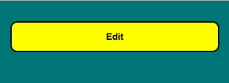
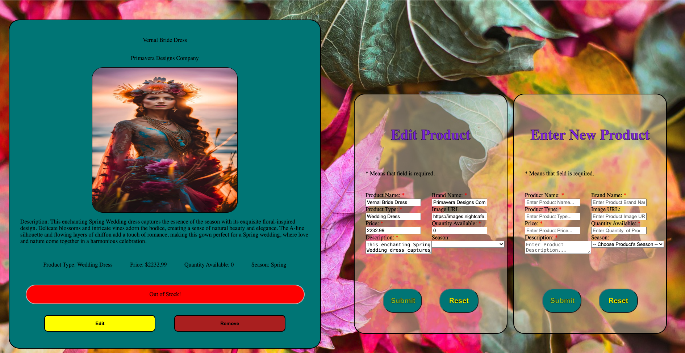

# Solstice-Equinox-Inventory-Application-Project

Welcome to Solstice Equinox, your premier destination for all things for any holiday or season! At Solstice Equinox, we understand the importance of providing a seamless shopping experience for our customers, and that's why we've developed the Solstice Equinox Inventory App. With this application, our dedicated team can effortlessly manage and update the inventory of our products, ensuring that our stellar collection is always in sync with our sellers inventory stock items. They will also be able to navigate through our products with ease as our intuitive CRUD functions empower our staff with the best app to create, read, update and delete the items of our stock. Welcome to Solstice Equinox, where the journey into the best seasonal e-commerce store begins!

## Getting Started

This is a simple web application for managing and displaying a product catalogue. The application allows users to add, edit, and remove products from the catalogue.

## Table of Contents
- [Overview](#overview)
- [Features](#features)
- [Usage](#usage)
- [Installation](#installation)
- [Information Input](#information-input)
- [Editing Information](#editing-information)
- [Remove and Clear Catalog](#remove-and-clear-catalog)
- [Contributing](#contributing)
- [License](#license)

## Overview

The Solstice Equinox Web App is built with HTML, CSS, and JavaScript. It allows users to interact with a product catalogue, including adding new products, editing existing ones, and removing products from the list.

## Features

- Add new products with detailed information.
- Edit existing products with an easy-to-use form.
- Remove products from the catalogue.
- Responsive design for a user-friendly experience on various devices.

## Usage

To use the application, simply open the `index.html` file in a web browser. The product catalogue will be displayed, and you can interact with the available products. Use the "Add Product" button to add new items, and the "Edit" and "Remove" buttons to modify or delete existing products.

## Installation

No installation is required for this web app. Simply clone the repository and open the `index.html` file in your preferred web browser.

## Information Input
In order for you to create a new product card with this application the following information will have to be inputted into the form:

##### *`Please note that not all entries for the input data will be text based some will be numbers, selectors or textarea, so please act accordingly when asked for entry of thism data.`*

- Product Name
- Brand Name
- Product Type
- Image URL
- Price
- Quantity Available
- Description
- Season

Be very aware of which information points you are entering as some of them are under a required information field to be filled requirement. These fields are pointed out by a red asterisk next to said data entry point. If this information is not entered an error message will pop up in the form stating: "Please fill out the required fields above!"

Finally, you have two buttons at the bottom of the form.

- Submit
- Reset

*`Submit:`*
Allows you to submit the new card you made, creating a new product card in the process.

*`Reset:`*
Will reset the data entry points to empty with their placeholders in place. 

## Editing Information
In order for you to edit a product card with this application first you will need to click on the edit button at the bottom of your desired product card. Then a new form will pop up next to the Enter New Product form called Edit Product. Then the following information you would like to change will have to be inputted into the edit form:

##### *`Please note that not all entries for the input data will be text based some will be numbers, selectors or textarea, so please act accordingly when asked for entry of thism data.`*

As above be very aware of which information points you are entering as some of them are under a required information field to be filled requirement. These fields are pointed out by a red asterisk next to said data entry point. If this information is not entered an error message will pop up in the form stating: "Please fill out the required fields above!"

Finally, you have two buttons at the bottom of the form.

- Submit
- Reset

*`Submit:`*
Allows you to submit the new edits you made to your product card, with your product card now appearing with the updated data.

*`Reset:`*
Will reset the data entry points to empty with their placeholders in place. 

## Remove and Clear Catalog
At the bottom of each of your product cards you find both an edit button and a remove button. We've gone over the edit button in the previous passage. Here we will cover how to remove a single product or if you had to how someone could delete the entire catalogue when necessary. 

*`Remove:`*
The remove button which would be found at the bottom of any of your product cards is used for removing the specific product card you pressed it on.

*`Clear Cataog:`*
At the bottom of the applications page you will find a button which reads as Clear Catalog. This button ca be used under the extreme circumstances where the entire catalog might need to be cleared and refreshed. Further future plans is to expand this button to target specific pages or chosen products. 

## Contributing
If you'd like to contribute to this project, please follow these steps:

1. Fork the repository.
2. Create a new branch: git checkout -b feature-name.
3. Make your changes and commit: git commit -m 'Add feature'.
4. Push to the branch: git push origin feature-name.
5. Submit a pull request.

## License
As this application was made for educational purposes only it is under free use licensing. However, if this changes in the future legal lincensing will be issued so this aplication may only be duplicated if for education purposes only.

Feel free to customize this template based on your project's specific details and features. Add more sections if needed, such as "Known Issues" or "Future Enhancements," to provide a comprehensive overview of your project.
